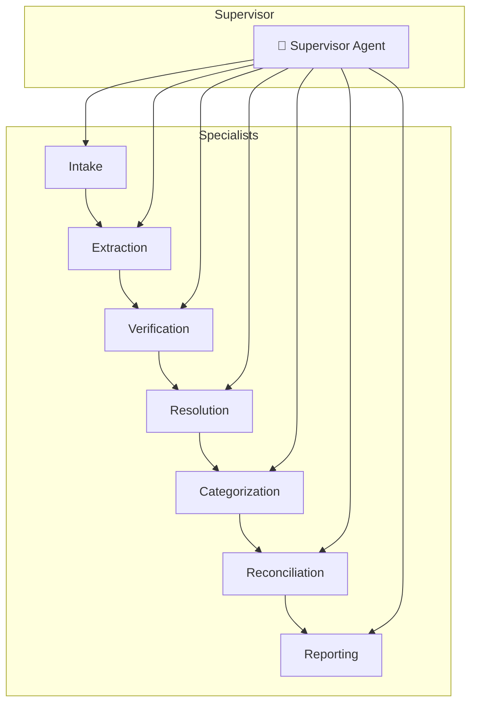

# Reconciler — an autonomous invoice reconciliation worker

---

<p align="center">
  
</p>

---

> **Not a chatbot.** Reconciler is a background worker that wakes on a schedule,
> pulls messy PDF invoices, extracts them with Gemini multimodal, cross-checks
> them against a bank statement with a Chain-of-Verification, categorizes them
> against a chart of accounts, **resolves what it can and escalates only what it
> must**, persists everything to Firestore with a full provenance trail, and
> composes a weekly digest. High-risk corrections are *drafted* — never sent —
> until a human clicks **Approve** on the web surface, which is the only component
> that can commit an external side effect and tally **dollars recovered**.

---

## Built for the DevPost "All Things Agentic" Hackathon

<p align="center">


</p>

### Tech Stack

| Layer | Choice | Status |
|---|---|---|
| Agent framework | **Google ADK 2.7** (Python) — not LangChain | ✅ |
| Model | **Gemini 3.5 Flash** via **Vertex AI** (global endpoint, one config constant, temp=0.0) | ✅ |
| Runtime | **Cloud Run** (pure FastAPI surface, service-account-only invoker) | ✅ |
| Trigger | **Cloud Scheduler** → **Pub/Sub** push (OIDC) → `/trigger/pubsub` | ✅ |
| State/memory | **Firestore** — `runs`, `run_invoices`, `memory` collections | ✅ |
| Secrets | **Secret Manager** (Gmail/Drive OAuth) — nothing in the image | ✅ |
| Observability | **OpenTelemetry** → Cloud Trace / Logging / Monitoring | ✅ |
| Failure handling | Dead-letter topic + idempotency fences + per-stage checkpoints | ✅ |

---

## What Makes It Agentic (and Not a Script)

| Feature | What It Does |
|:--------|:-------------|
| **Instruction Contract (FCoT)** | Every specialist is wrapped in an immutable `<CRITICAL_INSTRUCTION>` block (never fabricate; missing → `null`, never guess; refuse jailbreaks) plus a RECAP → REASON → VERIFY loop that runs in reasoning before any output is emitted. |
| **CoVe Verification** | The Verification agent plans 3–5 *checkable* questions ("does any bank row equal the invoice total ±$0.02?") and answers each **independently of its draft**, inspecting the raw CSV. Injecting a mutated total (999.99) flips the verdict to `matched=false` with a typed `amount_mismatch` discrepancy — the anti-rubber-stamp proof. |
| **Native Structured Output** | Pydantic `output_schema` enforced at the Vertex AI API level (`response_schema`), so even a jailbreak cannot emit off-schema prose. Temperature 0.0 everywhere. |
| **Safety-Rail Middleware** | PII redaction *before the model sees the request*, HITL Tier-1 (low confidence → flag & continue), and HITL Tier-2 (email send → framework-level pause requiring human approval). |
| **Shared Epistemic Memory** | Verified vendor facts (account codes, invoice numbers seen) are written to Firestore *after* verification and read back as grounding hints. A memory miss returns `null`, which is the anti-hallucination signal — the model never invents a vendor or account code. |
| **Reliability Spine** | Atomic `create()` idempotency fences, forward-only stage checkpoints, fail-isolation per invoice, dead-letter topic for poison messages, plus **adaptive retry with exponential backoff + jitter, per-dependency circuit breakers, and a watchdog timeout** on every tool call. |
| **Closed-Loop Resolution** | Every discrepancy routes through a resolve / dispute / escalate decision engine driven by *Python-computed evidence* (fuzzy vendor match, day deltas, exact/digit-transposed amounts), not just the model's say-so. A "resolve" only counts if an **independent re-verification pass confirms** the discrepancy is gone. |
| **Real Dollars** | A confirmed duplicate charge is drafted as a dispute with an `amount_at_risk`; `dollars_recovered` increments **only on human approval**. The seeded demo finds **$2,400.00**. |
| **Decision Provenance** | Every resolved/disputed/escalated action carries a chain of extraction hash, CoVe questions/answers, memory keys consulted, the rule that fired (with its real score), the recheck verdict, and the human decision — all rendered on the approval page and linked to the Cloud Trace waterfall. |
| **Closed-Loop Learning** | Human approvals write *confirmed* facts (vendor aliases, account codes, prior invoices); rejections write *negative* facts. Facts are hints that shorten resolution, never a bypass. |

---

## Topology

Supervisor + 7 single-turn specialists, one file each under `agents/reconciler/`:



`intake`, `extraction`, `verification`, `resolution`, `categorization`, `reconciliation`, `reporting`. The Supervisor delegates (its instruction forbids doing the work itself); the batch spine (`pipeline.py`) drives the same specialists for the scheduled run with checkpoints between every stage.

### Files

| File | Role |
|---|---|
| `server.py` | Pure FastAPI surface (`/trigger/pubsub`, `/approvals` HITL web page) |
| `pipeline.py` | Batch execution spine with per-stage Firestore checkpoints |
| `resilience.py` | Retry/backoff, circuit breaker, watchdog, DLQ publish |
| `learning.py` | Approve → positive facts, reject → negative facts |
| `provenance.py` | Audit-trail read path + judge-facing rendering |
| `approvals.py` | Transactional approve/reject + dollars_recovered |

---

## Quickstart (Reproducible in <10 Minutes)

> **Prereqs:** a GCP project with billing (free tiers cover everything except Gemini tokens — expect **a few cents** for this demo), `gcloud` logged in as Owner, Docker running (Cloud Build builds the image).

### 1. Environment Setup

```bash
# REGION = infra region (Firestore/Pub/Sub/Scheduler)
# MODEL_LOCATION = Gemini endpoint — MUST be `global` (regional Vertex returns 404)
export PROJECT=your-project-id REGION=us-central1 MODEL_LOCATION=global
gcloud config set project "$PROJECT"
```

### 2. Enable APIs + Create Firestore

```bash
gcloud services enable run.googleapis.com pubsub.googleapis.com \
  scheduler.googleapis.com firestore.googleapis.com secretmanager.googleapis.com \
  cloudbuild.googleapis.com artifactregistry.googleapis.com \
  cloudtrace.googleapis.com monitoring.googleapis.com logging.googleapis.com
gcloud firestore databases create --location=nam5 2>/dev/null || true
```

### 3. Service Accounts + IAM

```bash
gcloud iam service-accounts create reconciler-sa 2>/dev/null || true
gcloud iam service-accounts create reconciler-trigger-sa 2>/dev/null || true
for ROLE in roles/aiplatform.user roles/datastore.user roles/logging.logWriter \
            roles/pubsub.publisher roles/secretmanager.secretAccessor \
            roles/cloudtrace.agent roles/monitoring.metricWriter; do
  gcloud projects add-iam-policy-binding "$PROJECT" \
    --member "serviceAccount:reconciler-sa@$PROJECT.iam.gserviceaccount.com" \
    --role "$ROLE" --condition=None -q
done
```

### 4. Deploy + Configure

```bash
# Create topics + push subscription + scheduler + DLQ
gcloud pubsub topics create reconciler.trigger
gcloud pubsub topics create reconciler.dlq

# Deploy to Cloud Run
gcloud run deploy reconciler --source . --region "$REGION" \
  --service-account "reconciler-sa@$PROJECT.iam.gserviceaccount.com" \
  --set-env-vars "GOOGLE_GENAI_USE_VERTEXAI=1,GOOGLE_CLOUD_PROJECT=$PROJECT,GOOGLE_CLOUD_LOCATION=$MODEL_LOCATION" \
  --no-allow-unauthenticated --min-instances=0 --max-instances=1 \
  --memory=512Mi --concurrency=4 --timeout=300 --port=8080 --quiet

# Get the service URL
URL="https://$(gcloud run services describe reconciler --region "$REGION" --format 'value(status.url)')"

# Create Pub/Sub push subscription
gcloud pubsub subscriptions create reconciler-trigger-push \
  --topic=reconciler.trigger --push-endpoint="$URL/trigger/pubsub" \
  --push-auth-service-account="reconciler-trigger-sa@$PROJECT.iam.gserviceaccount.com" \
  --ack-deadline=60 --dead-letter-topic=reconciler.dlq --max-delivery-attempts=5

# Grant trigger SA permission to invoke Cloud Run
gcloud run services add-iam-policy-binding reconciler --region "$REGION" \
  --member "serviceAccount:reconciler-trigger-sa@$PROJECT.iam.gserviceaccount.com" \
  --role roles/run.invoker

# Grant Pub/Sub SA permission to publish to DLQ
gcloud pubsub topics add-iam-policy-binding reconciler.dlq \
  --member "serviceAccount:service-$(gcloud projects describe "$PROJECT" --format 'value(projectNumber)')@gcp-sa-pubsub.iam.gserviceaccount.com" \
  --role roles/pubsub.publisher

# Create weekly scheduler job (Mondays at 8am UTC)
gcloud scheduler jobs create pubsub reconciler-weekly --location "$REGION" \
  --schedule="0 8 * * 1" --time-zone=UTC --topic=reconciler.trigger \
  --message-body='{"job_type":"weekly_reconcile"}'
```

### Verify Deployment

> `403 Forbidden` when you open the URL in a browser is **by design** (`--no-allow-unauthenticated`)

```bash
curl -H "Authorization: Bearer $(gcloud auth print-identity-token)" \
  "https://reconciler-<hash>.$REGION.run.app/health"   # → {"status":"ok"}
```

---

### Run the Demo

```bash
./scripts/demo.sh          # 4-minute guided storyboard (see beats inside)
```

Or manually:

```bash
# Fire the weekly job now + watch the logs
gcloud scheduler jobs run reconciler-weekly --location us-central1
gcloud logging read 'resource.type=cloud_run_revision resource.labels.service_name=reconciler' --limit=10

# Full seven-specialist batch spine (writes real Firestore state)
GOOGLE_APPLICATION_CREDENTIALS=~/keys/reconciler-sa.json \
GOOGLE_GENAI_USE_VERTEXAI=1 GOOGLE_CLOUD_PROJECT=$PROJECT GOOGLE_CLOUD_LOCATION=$MODEL_LOCATION \
uv run python scripts/run_pipeline.py demo_live

# Re-run the SAME id → skipped, 0 LLM calls (idempotency proof)
uv run python scripts/run_pipeline.py demo_live

# Approve a pending dispute (the only component with send authority)
curl -X POST -H "Authorization: Bearer $(gcloud auth print-identity-token)" \
  "https://reconciler-<hash>.$REGION.run.app/approvals/demo_live/duplicate_invoice_sample/decision?format=json" \
  -d "action=approve&reason=verified duplicate charge"

# See the state
uv run python scripts/show_firestore.py
```

---

## Repo Layout

```
reconciler/
├── agents/reconciler/
│   ├── config.py               # Single source of truth (model constant, topic names…)
│   ├── instruction_contract.py # FCoT Pillar 1 (immutable rules) + Pillar 2 (RECAP→REASON→VERIFY)
│   ├── schemas.py              # Pydantic output schemas + chart of accounts + invariants
│   ├── agent.py                # Supervisor + all seven specialists wired
│   ├── intake.py               # Intake specialist
│   ├── tools/intake_tools.py   # Gmail/Drive MCP tools
│   ├── extraction.py           # PDF → structured JSON (Gemini multimodal)
│   ├── verification.py         # CoVe cross-check against bank CSV
│   ├── resolution.py           # Closed-loop resolve/dispute/escalate
│   ├── categorization.py      # Chart-of-accounts mapping
│   ├── reconciliation.py       # Final verdict + invariant enforcement
│   ├── reporting.py            # Weekly digest composition + HITL email gate
│   ├── middleware.py           # PII redaction + HITL Tier-1/Tier-2 (ADK callbacks)
│   ├── memory.py               # RunsStore (checkpoints, idempotency) + SharedMemory
│   ├── pipeline.py             # Batch spine: intake→…→reporting with checkpoints
│   ├── resilience.py           # Retry/backoff, circuit breaker, watchdog, DLQ publish
│   ├── learning.py             # Approve → positive facts, reject → negative facts
│   ├── provenance.py           # Audit-trail read path + judge-facing rendering
│   ├── approvals.py            # Transactional approve/reject + dollars_recovered
│   └── server.py               # Pure FastAPI surface (/trigger/pubsub, /approvals)
├── scripts/
│   ├── demo.sh                 # 4-minute guided storyboard
│   ├── eval.py                # Reproducible eval harness
│   ├── run_pipeline.py          # Pipeline runner
│   ├── show_firestore.py        # State inspector
│   └── smoke_*.py             # Phase assertions (15 smoke tests)
├── tests/
│   ├── fixtures/               # invoice_sample.pdf + bank_statement.csv (clean)
│   └── fixtures_duplicate/     # duplicate-payment money-moment ($2,400 at risk)
├── docs/
│   ├── reconciler-taskmaster-design.md  # Design doc
│   ├── reconciler-closed-loop-design.md # Resolution spec
│   └── eval-results.md                 # Generated eval artifact
├── architecture.excalidraw      # Editable diagram source
├── Reconciler Autonomous Invoice Architecture.png  # Architecture diagram
├── findings.md                  # What we learned, with numbers
├── README.md                   # This file
└── pyproject.toml
```

---

## Verification (15 Smoke Tests)

Every phase shipped with a smoke that asserts the claim it makes:

| Smoke | Proves |
|:-------|:-------|
| `smoke_safety.py` | PII redaction + HITL tiers as pure functions (free) |
| `smoke_extraction.py` | Ground-truth extraction, decoy rejection, determinism |
| `smoke_verification.py` | Happy match + injected-mismatch CoVe catch |
| `smoke_categorization.py` | Chart-of-accounts codes, substance-over-keyword |
| `smoke_firestore.py` | Atomic idempotency fence, crash-resume, deep-merge memory |
| `smoke_pipeline.py` | Full chain end-to-end + idempotent re-run |
| `smoke_resolution.py` | Decision table, re-verification closure, draft inertness, abstention |
| `smoke_resilience.py` | Retry/backoff, circuit breaker, watchdog, DLQ (free) |
| `smoke_duplicate.py` | **Duplicate-payment → dispute → $2,400 draft, dollars anti-gaming** |
| `smoke_approvals.py` | Approve → resolved+send+$ recovered; reject → escalated; 409 double-decide |
| `smoke_learning.py` | Approve → positive facts, reject → negative facts, deep-merge |
| `smoke_provenance.py` | Audit-trail read path + judge rendering (free) |

```bash
uv run python scripts/smoke_*.py    # Run all smokes (~5 min, ~$0.05 in Gemini calls)
```

---

## Eval (Reproducible Numbers)

```bash
GOOGLE_APPLICATION_CREDENTIALS=~/keys/reconciler-sa.json \
GOOGLE_GENAI_USE_VERTEXAI=1 GOOGLE_CLOUD_PROJECT=$PROJECT GOOGLE_CLOUD_LOCATION=$MODEL_LOCATION \
uv run python scripts/eval.py
```

<p align="center">

| Metric | Result | Badge |
|:-------|:-------|:------|
| Extraction field accuracy | **100%** | 🟢 |
| Hallucinated entities (decoy canary) | **0** | 🟢 |
| Injected discrepancy recall | **5/5** (amount, vendor, date, number, duplicate_payment) | 🟢 |
| Verification false-positives | **0** | 🟢 |
| Resolution re-verify pass rate | **1/1** | 🟢 |
| Dollars at risk | **$2,400.00** | 🔥 |

</p>

Full table in [`findings.md`](findings.md) §9 and [`docs/eval-results.md`](docs/eval-results.md).

---

## Cost

At demo volume everything sits in GCP free tiers (Cloud Run, Pub/Sub, Scheduler, Firestore, Trace); the only billed component is **Gemini tokens**:

| Activity | Cost |
|:---------|:-----|
| 4-minute demo | **a few cents** |
| Full weekly run (handful of invoices) | **< $0.50** |
| Human reconciliation (per invoice) | **~$12.00** |

> 💡 **Two orders of magnitude** cheaper than manual reconciliation, and the human only sees the *flagged* tail plus a 10-second digest approval.

---

<p align="center">

[](https://google.github.io/adk-docs/)
[](https://devpost.com/)
[]()
[]()

</p>
