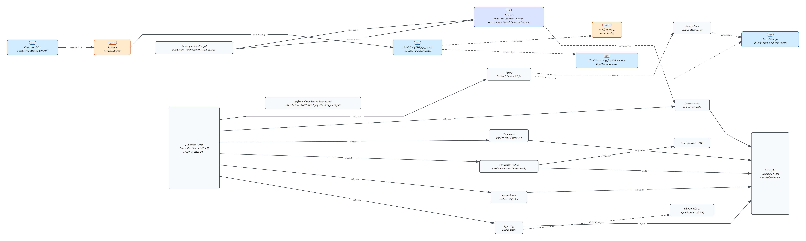

# Reconciler — an autonomous invoice reconciliation worker

**Not a chatbot.** Reconciler is a background worker that wakes on a schedule,
pulls messy PDF invoices, extracts them with Gemini multimodal, cross-checks
them against a bank statement with a Chain-of-Verification, categorizes them
against a chart of accounts, flags discrepancies, persists everything to
Firestore, and composes a weekly digest — escalating only what a human
actually needs to see, and only *sending* anything after a human approves it.

Built for the DevPost **"All Things Agentic"** hackathon (Taskmaster track) on
a deliberately non-default stack:

| Layer | Choice |
|---|---|
| Agent framework | **Google ADK 2.7** (Python) — not LangChain |
| Model | **Gemini 2.5 Flash** via **Vertex AI** (one config constant, temp=0.0) |
| Runtime | **Cloud Run** (`adk api_server`, service-account-only invoker) |
| Trigger | **Cloud Scheduler** → **Pub/Sub** push (OIDC) → `/trigger/pubsub` |
| State/memory | **Firestore** — `runs`, `run_invoices`, `memory` collections |
| Secrets | **Secret Manager** (Gmail/Drive OAuth) — nothing in the image |
| Observability | **OpenTelemetry** → Cloud Trace / Logging / Monitoring |
| Failure handling | Dead-letter topic + idempotency fences + per-stage checkpoints |



## What makes it agentic (and not a script)

- **Instruction Contract (FCoT)** — every specialist is wrapped in an
  immutable `<CRITICAL_INSTRUCTION>` block (never fabricate; missing → `null`,
  never guess; refuse jailbreaks) plus a RECAP → REASON → VERIFY loop that
  runs in reasoning before any output is emitted.
- **CoVe verification** — the Verification agent plans 3–5 *checkable*
  questions ("does any bank row equal the invoice total ±$0.02?") and answers
  each **independently of its draft**, inspecting the raw CSV. Injecting a
  mutated total (999.99) flips the verdict to `matched=false` with a typed
  `amount_mismatch` discrepancy — the anti-rubber-stamp proof.
- **Native structured output** — Pydantic `output_schema` enforced at the
  Vertex AI API level (`response_schema`), so even a jailbreak cannot emit
  off-schema prose. Temperature 0.0 everywhere.
- **Safety-rail middleware on every agent** (ADK callbacks): PII redaction
  *before the model sees the request*, HITL Tier-1 (low confidence → flag &
  continue), and HITL Tier-2 (email send → framework-level pause requiring
  human approval).
- **Shared Epistemic Memory** — verified vendor facts (account codes, invoice
  numbers seen) are written to Firestore *after* verification and read back as
  grounding hints. A memory miss returns `null`, which is the anti-hallucination
  signal — the model never invents a vendor or account code.
- **Reliability spine** — atomic `create()` idempotency fences (at-least-once
  Pub/Sub redelivery can't double-process), forward-only stage checkpoints
  (crash → resume at the next stage, not from zero), fail-isolation per
  invoice, dead-letter topic for poison messages.

## Topology

Supervisor + 6 single-turn specialists, one file each under `agents/reconciler/`:
`intake`, `extraction`, `verification`, `categorization`, `reconciliation`,
`reporting`. The Supervisor delegates (its instruction forbids doing the work
itself); the batch spine (`pipeline.py`) drives the same specialists for the
scheduled run with checkpoints between every stage.

## Quickstart (reproducible in <10 minutes)

Prereqs: a GCP project with billing (free tiers cover everything except
Gemini tokens — expect **a few cents** for this demo), `gcloud` logged in as
Owner, Docker running (Cloud Build builds the image).

```bash
# 0) env
export PROJECT=your-project-id REGION=us-central1
gcloud config set project "$PROJECT"

# 1) enable APIs + create Firestore (skip any that exist)
gcloud services enable run.googleapis.com pubsub.googleapis.com \
  scheduler.googleapis.com firestore.googleapis.com secretmanager.googleapis.com \
  cloudbuild.googleapis.com artifactregistry.googleapis.com \
  cloudtrace.googleapis.com monitoring.googleapis.com logging.googleapis.com
gcloud firestore databases create --location=nam5 2>/dev/null || true

# 2) runtime + trigger service accounts (least privilege)
gcloud iam service-accounts create reconciler-sa 2>/dev/null || true
gcloud iam service-accounts create reconciler-trigger-sa 2>/dev/null || true
for ROLE in roles/aiplatform.user roles/datastore.user roles/logging.logWriter \
            roles/pubsub.publisher roles/secretmanager.secretAccessor \
            roles/cloudtrace.agent roles/monitoring.metricWriter; do
  gcloud projects add-iam-policy-binding "$PROJECT" \
    --member "serviceAccount:reconciler-sa@$PROJECT.iam.gserviceaccount.com" \
    --role "$ROLE" --condition=None -q
done

# 3) topics + push subscription + scheduler + DLQ
gcloud pubsub topics create reconciler.trigger
gcloud pubsub topics create reconciler.dlq
gcloud run deploy reconciler --source . --region "$REGION" \   # deploy first to get URL
  --service-account "reconciler-sa@$PROJECT.iam.gserviceaccount.com" \
  --set-env-vars "GOOGLE_GENAI_USE_VERTEXAI=1,GOOGLE_CLOUD_PROJECT=$PROJECT,GOOGLE_CLOUD_LOCATION=$REGION" \
  --no-allow-unauthenticated --min-instances=0 --max-instances=1 \
  --memory=512Mi --concurrency=4 --timeout=300 --port=8080 --quiet
URL="https://$(gcloud run services describe reconciler --region "$REGION" --format 'value(status.url)')"
gcloud pubsub subscriptions create reconciler-trigger-push \
  --topic=reconciler.trigger --push-endpoint="$URL/trigger/pubsub" \
  --push-auth-service-account="reconciler-trigger-sa@$PROJECT.iam.gserviceaccount.com" \
  --ack-deadline=60 --dead-letter-topic=reconciler.dlq --max-delivery-attempts=5
gcloud run services add-iam-policy-binding reconciler --region "$REGION" \
  --member "serviceAccount:reconciler-trigger-sa@$PROJECT.iam.gserviceaccount.com" \
  --role roles/run.invoker
gcloud pubsub topics add-iam-policy-binding reconciler.dlq \
  --member "serviceAccount:service-$(gcloud projects describe "$PROJECT" --format 'value(projectNumber)')@gcp-sa-pubsub.iam.gserviceaccount.com" \
  --role roles/pubsub.publisher
gcloud scheduler jobs create pubsub reconciler-weekly --location "$REGION" \
  --schedule="0 8 * * 1" --time-zone=UTC --topic=reconciler.trigger \
  --message-body='{"job_type":"weekly_reconcile"}'
```

`403 Forbidden` when you open the URL in a browser is **by design**
(`--no-allow-unauthenticated` — only the trigger SA may invoke it):

```bash
curl -H "Authorization: Bearer $(gcloud auth print-identity-token)" \
  "https://reconciler-<hash>.$REGION.run.app/health"   # → {"status":"ok"}
```

### Run the demo

```bash
./scripts/demo.sh          # 4-minute guided storyboard (see beats inside)
```

Or manually:

```bash
# fire the weekly job now + watch the logs
gcloud scheduler jobs run reconciler-weekly --location us-central1
gcloud logging read 'resource.type=cloud_run_revision resource.labels.service_name=reconciler' --limit=10

# full six-specialist batch spine (writes real Firestore state)
GOOGLE_APPLICATION_CREDENTIALS=~/keys/reconciler-sa.json \
GOOGLE_GENAI_USE_VERTEXAI=1 GOOGLE_CLOUD_PROJECT=$PROJECT GOOGLE_CLOUD_LOCATION=$REGION \
uv run python scripts/run_pipeline.py demo_live

# re-run the SAME id → skipped, 0 LLM calls (idempotency proof)
uv run python scripts/run_pipeline.py demo_live

# see the state
uv run python scripts/show_firestore.py
```

Gmail/Drive intake (`agents/reconciler/tools/intake_tools.py`) reads its OAuth
refresh token from Secret Manager secret `reconciler-oauth-config` and never
writes credentials to disk. Without it, the pipeline runs on the bundled
fixture invoice (`tests/fixtures/invoice_sample.pdf` vs `bank_statement.csv`).

## Repo layout

```
agents/reconciler/
  config.py               # single source of truth (model constant, topic names…)
  instruction_contract.py # FCoT Pillar 1 (immutable rules) + Pillar 2 (RECAP→REASON→VERIFY)
  schemas.py              # Pydantic output schemas + chart of accounts + invariants
  agent.py                # Supervisor + all six specialists wired
  intake.py tools/intake_tools.py
  extraction.py verification.py categorization.py reconciliation.py reporting.py
  middleware.py           # PII redaction + HITL Tier-1/Tier-2 (ADK callbacks)
  memory.py               # RunsStore (checkpoints, idempotency) + SharedMemory
  pipeline.py             # batch spine: intake→…→reporting with checkpoints
scripts/                  # demo.sh, run_pipeline.py, show_firestore.py, smokes
tests/fixtures/           # deterministic invoice PDF + bank CSV (with decoys)
architecture.excalidraw   # editable diagram source (PNG export alongside)
findings.md               # what we learned, with numbers
```

## Verification

Every phase shipped with a smoke that asserts the claim it makes
(`uv run python scripts/smoke_*.py`; the ones calling Vertex cost ~$0.01–0.03):

| Smoke | Proves |
|---|---|
| `smoke_safety.py` | PII redaction + HITL tiers as pure functions (free) |
| `smoke_extraction.py` | ground-truth extraction, decoy rejection, determinism |
| `smoke_verification.py` | happy match + injected-mismatch CoVe catch |
| `smoke_categorization.py` | chart-of-accounts codes, substance-over-keyword |
| `smoke_firestore.py` | atomic idempotency fence, crash-resume, deep-merge memory |
| `smoke_pipeline.py` | full chain end-to-end + idempotent re-run |

## Cost

At demo volume everything sits in GCP free tiers (Cloud Run, Pub/Sub,
Scheduler, Firestore, Trace); the only billed component is Gemini tokens —
the whole 4-minute demo costs **a few cents**, a full weekly run with a
handful of invoices well under $0.50, versus ~$12 human cost per invoice.
